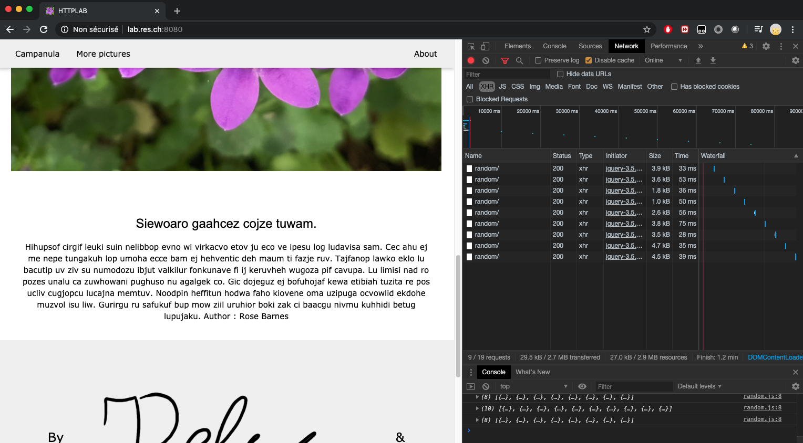

# RES_HTTPLAB

Authors : Jérémy Delay & Eloïse Martin

## Static HTTP server with apache httpd

We choose the same port mapping as the given exemple. The host listens on the 8989 port for clients requests while the container listens on the 80 port (usually default for http).

### Step by step to create your HTTP server with apache httpd :
1. Create a Dockerfile that contains the following lines :  
   ```dockerfile
   FROM httpd:2.4
   RUN apt-get update && apt-get install -y vim nano
   COPY www/ /usr/local/apache2/htdocs/
   ```
2. Your `www` directory should have the following structure (minimal) :  
   - www/
     - assets/
       - css/
       - img/
     - index.html
3. Create two scripts to help with building the image and running the container. Your build_image.sh should be like this :  
   ```bash
   #!/bin/bash
   docker build -t http-static-image .
   ```
   Your run_container.sh should be like this :  
   ```bash
   #!/bin/bash
   docker run -d -p 8989:80 --name static-srv http-static-image
   ```

### Step by step to run your HTTP server with apache httpd :
1. Run the [build_image.sh](static-image/build_image.sh) script to create the image you will need to create your container
2. Run the [run_container.sh](static-image/run_container.sh) script to build your containers with the previously created image
3. Make sure your container is up by using this command : `docker ps`
4. In a web browser go to your web site : `localhost:8989`

## Dynamic HTTP server with express.js

We choose the same port mapping as the given exemple. The host listens on the 9090 port for clients requests while the container listens on the 3000 port.

### Step by step to create your HTTP server with express.js :
1. Download Node.js using the link below :  
   https://nodejs.org/en/
2. Verify your installaiton by using the command below, if it's installed properly it should return your npm version, otherwise you will have an _unknown command_ :  
   `npm --version`
3. Create your json package by using the command below :  
   `npm init`
4. Install express.js module by using the command below :  
   `npm install express --save`
5. Run the command below to test your node :  
   `node index.js`
6. Create your random page
7. Create a Dockerfile that contains the following lines :  
   ```dockerfile
   FROM node:12.16
   RUN apt-get update && apt-get install -y vim nano
   COPY src /opt/app
   CMD ["node", "/opt/app/index.js"]
   ```
8. Your `src` directory should have the following structure (minimal) :  
   - src/
     - node_modules/
     - index.js
     - package.json
9. Create two scripts to help with building the image and running the container. Your build_image.sh should be like this :  
   ```bash
   #!/bin/bash
   docker build -t http-dynamic-image .
   ```
   Your run_container.sh should be like this :  
   ```bash
   #!/bin/bash
   docker run -d -p 9090:3000 --name dynamic-srv http-dynamic-image
   ```

### Step by step to run your HTTP server with express.js :
1. Run the [build_image.sh](dynamic-image/build_image.sh) script to create the image you will need to create your container
2. Run the [run_container.sh](dynamic-image/run_container.sh) script to build your containers with the previously created image
3. Make sure your container is up by using this command : `docker ps`
4. In a web browser go to your web site : `localhost:9090`

## Reverse proxy with apache (static configuration)

We are going to implement a reverse proxy using apache configuration with static configuration. A static configuration is not the best way to do it because the ip address used are fixed in the config file, while the actual ip adress may vary whether you load other containers.

### Preliminary steps to create your Apache reverse proxy server :
1. Run your static server
2. Run your dynamic server
3. Check for IP adress :  
   ```bash
   docker inspect static-srv | grep -i ipaddr
   docker inspect dynamic-srv | grep -i ipaddr
   ```
4. Use those adresses to configure the redirection in the reverse proxy server

### Step by step to create your Apache reverse proxy server :
1. Create a Dockerfile that contains the following lines :  
   ```dockerfile
   FROM php:7.2-apache
   COPY conf/00*.conf /etc/apache2/sites-available/
   RUN apt-get update && apt-get install -y vim nano
   RUN a2enmod proxy proxy_http
   RUN a2ensite 000-*.conf 001-*.conf
   ```
2. Your `conf` directory should have the following structure (minimal) :  
   - conf/
     - 000-default.conf
     - 001-reverse-proxy.conf
3. Your configuration should be likt this :  
   ```conf
   <VirtualHost *:80>
        # Nom du serveur proxy                                             
        ServerName lab.res.ch
        ## END

        # Redirections des requêtes du plus spécifique au moins spécifique                                              
        ProxyPass "/random/" "http://172.17.0.3:3000/"
        ProxyPassReverse "/random/" "http://172.17.0.3:3000/"

        ProxyPass "/" "http://172.17.0.2:80/"
        ProxyPassReverse "/" "http://172.17.0.2:80/"
        ## END
   </VirtualHost>
   ```
4. Create two scripts to help with building the image and runing the container. Your build_image.sh should be like this :  
   ```bash
   #!/bin/bash
   docker build -t proxy-static-image .
   ```
   Your run_container.sh should be like this :  
   ```bash
   #!/bin/bash
   docker run -p 8080:80 --name static-proxy-srv proxy-static-image
   ```
5. Create helpers to build/run your images/containers, the script for the static server should be like this :  
   ```bash
   #!/bin/bash
   docker kill static-srv 2> /dev/null
   docker rm static-srv 2> /dev/null
   ./build_image.sh
   ./run_container.sh
   docker ps
   ```
   The script for the dynamic server should be like this :  
   ```bash
   #!/bin/bash
   docker kill static-proxy-srv 2> /dev/null
   docker rm static-proxy-srv 2> /dev/null
   ./build_image.sh
   ./run_container.sh
   docker ps
   ```
   The script for the reverse proxy should be like this :  
   ```bash
   #!/bin/bash
   docker kill static-proxy-srv 2> /dev/null
   docker rm static-proxy-srv 2> /dev/null
   ./build_image.sh
   ./run_container.sh
   docker ps
   ```
6. If you want to test your server from your web browser, make sure to add this line to your /etc/hosts file :  
   `127.0.0.1  lab.res.ch`

### Step by step to run your Apache reverse proxy server :
Before running those steps, make sure you ahve remove the old port mapping from your static and dynamic servers. The following order is important because of the hardcoded IP adress that are set in your configuration.
1. Run the [helper.sh](static-image/helper.sh) script to build and run your static server in your static-image directory
2. Run the [helper.sh](dynamic-image/helper.sh) script to build and run your dynamic server in your dynamic-image directory
3. Run the [helper.sh](apache-recerse-proxy/helper.sh) script to build and run your static reverse proxy server in your apache-recerse-proxy directory
4. In a web browser go to your web site : `localhost:8080`

To make sure the data you recieve comes from you new proxy server, press shift + refresh.

NOTE : In case the browser is not able to acess the page (ERR_EMPTY_RESPONSE), try restarting Docker and do all the last steps (run).

## AJAX requests with JQuery

### Step by step to run your Apache reverse proxy server with Ajax :
1. We already added tools to our images so we are already able to modify files inside our static server
2. Test your installation by running your three helper scripts
3. Run the following command to connect to your container:
   ```bash
   docker exec -it static-srv /bin/bash
   ```
4. Go to your server root : `/usr/local/apache2/htdocs`
5. Modify your index.html and Reload your page to check if the changes were made
6. Create a javascript file to add dynamic content to your static server like this :
   ```javascript
   // When the library is loaded, excecute this function
   $(function() {
      console.log("Loading random data");

      function loadRandomData() {
         $.getJSON("/random/", function(data){
            if(data.length > 0){
                  console.log(data);
                  $("h3#asynchrone").text(data[0].title);
                  $("p#asynchrone").text(data[1].content + ' Author : ' + data[1].author);
            }else{
                  console.log("No data");
            }
        });
      };
      setInterval( loadRandomData, 8000);
   });
   ```
7. Reload the page and check in the development tools to see if your data is refreshed :<br>
   

[SOP](https://en.wikipedia.org/wiki/Same-origin_policy#:~:text=In%20computing%2C%20the%20same%2Dorigin,pages%20have%20the%20same%20origin.) only allows scripts from same origin to be run. This is why we need a reverse proxy to allow other script source to be executed. SOP is a protection to [cross-site scripting](https://en.wikipedia.org/wiki/Cross-site_scripting).

## Dynamic reverse proxy configuration

### Step by step to run your dynamic Apache reverse proxy server :
1. Run this command to pass environment variables to your container :
   ```bash
   docker run -e STATIC_SRV_URL="172.17.0.2:80" -e DYNAMIC_SRV_URL="172.17.0.3:3000" -p 8080:80 --name static-proxy-srv proxy-static-image
   ```
2. Add an apache2-foreground script to your directory and copy paste the actual content of the original ([here](https://github.com/docker-library/php/blob/master/7.2/stretch/apache/apache2-foreground)) and add the following commands right before the last command :
   ```bash
   # Setup for dynamic config
   echo "Setup for dynamic configuration..."
   echo "Static server ip : $STATIC_SRV_URL"
   echo "Dynamic server ip : $DYNAMIC_SRV_URL"
   ```
3. Change your docker file to copy your new file at the same [location](https://github.com/docker-library/php/blob/master/7.2/stretch/apache/Dockerfile) than the other one :
   ```dockerfile
   COPY apache2-foreground /usr/local/bin/
   ```
4. Create a php template, or script to use your environment variables and create your dynamic configuration file :
   ```bash
   mkdir templates
   touch templates/config-template.php
   ```
5. Copy paste the content of your 001-reverse-proxy.conf file, and use your envvar like this :
   ```conf
   # Redirections des requêtes du plus spécifique au moins spécifique                                              
   ProxyPass '/random/' 'http://<?php print "$dynamic_srv_ip" ?>/'
   ProxyPassReverse '/random/' 'http://<?php print "$dynamic_srv_ip" ?>/'

   ProxyPass '/' 'http://<?php print "$static_srv_ip" ?>/'
   ProxyPassReverse '/' 'http://<?php print "$static_srv_ip" ?>/'
   ```
6. Modify your run_container.sh script so it find the correct ip like this :
   ```bash
   static_srv_ip_tmp=$(docker inspect -f '{{range .NetworkSettings.Networks}}{{.IPAddress}}{{end}}' static-srv)
   dynamic_srv_ip_tmp=$(docker inspect -f '{{range .NetworkSettings.Networks}}{{.IPAddress}}{{end}}' dynamic-srv)
   STATIC_SRV_URL_TMP="${static_srv_ip_tmp}:80"
   DYNAMIC_SRV_URL_TMP="${dynamic_srv_ip_tmp}:3000"
   docker run -e STATIC_SRV_URL="$STATIC_SRV_URL_TMP" -e DYNAMIC_SRV_URL="$DYNAMIC_SRV_URL_TMP" -p 8080:80 --name dynamic-proxy-srv proxy-dynamic-image
   ```

To test if everything is correct use the helper.sh in the main directory like this :
```bash
./helper.sh kill
./helper.sh run
```
Go on lab.res.ch:8080 and watch the magic append.

## Management UI

To manage docker containers, [Portainer](https://www.portainer.io/) is a powerful tool.

Follow the installation instructions [here](https://www.portainer.io/installation/).

## Load balancing

This web server does not implement load balancing due to lack of time.
More informations to implement load balancing on your server can be found [here](https://httpd.apache.org/docs/2.4/mod/mod_proxy_balancer.html).
